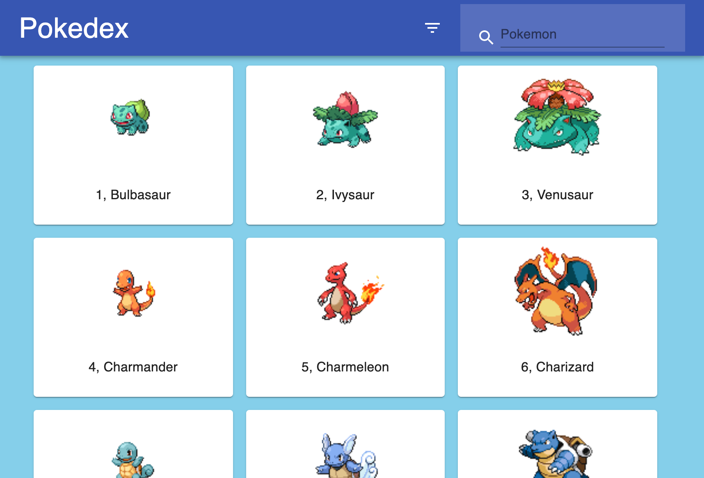

# Pokedex(React-app)

## about this app
I created this app because I wanted to use material-ui.
pokeAPI is used to get all the data of pokemons.
this project is not deployed so check the pic down below

## preview
